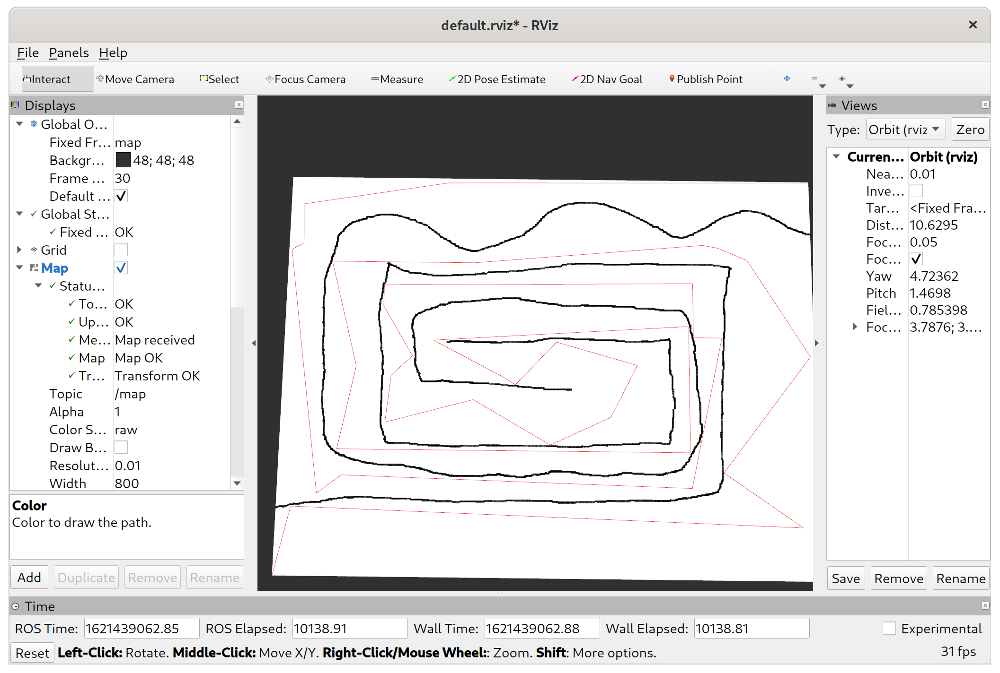

A small implementation of Rapidly Exploring Random Trees in Haskell and C++20

See: https://en.wikipedia.org/wiki/Rapidly-exploring_random_tree

The C++ implementation has a ROS interface:

-------------------------------

A bug in http://www.dgp.toronto.edu/~mac/pubs/rrt-blossom.pdf

Consider the follosing case of blossoming search (Algorithm 4) (without nullary
control inputs).

- An iteration of the search has a target configuration, `t`
- During the blossoming phase
  - A control input leads to a configuration, `n`, exactly on the end goal
    (certainly possible in discrete spaces).
  - Another control input leads to a configuration, `m`, closer to `t` than `n`
- The configuration returned by `GROW_TREE` is `m` as it is the closest to the
  target for this iteration `t`. The program does not terminate despite the
  fact that the goal has been reached, as the only configuration checked for
  proximity to the goal is `m`.
- The program can never rediscover the goal, as it will always count as a
  regression as the distance from the already discovered `n` will be minimal.

There are two possible corrections:

- Have every addition to the tree checked for proximity to the goal
- Check for the case where the nearest neighbor has zero distance away from the
  target.

The first solution has the advantage that the algorithm terminates promptly
when a solution is found, however it's not clear whether it is sufficient for
the dual tree search where the two trees could cover each other and their
respectve goals with alternate paths (proof pending).
