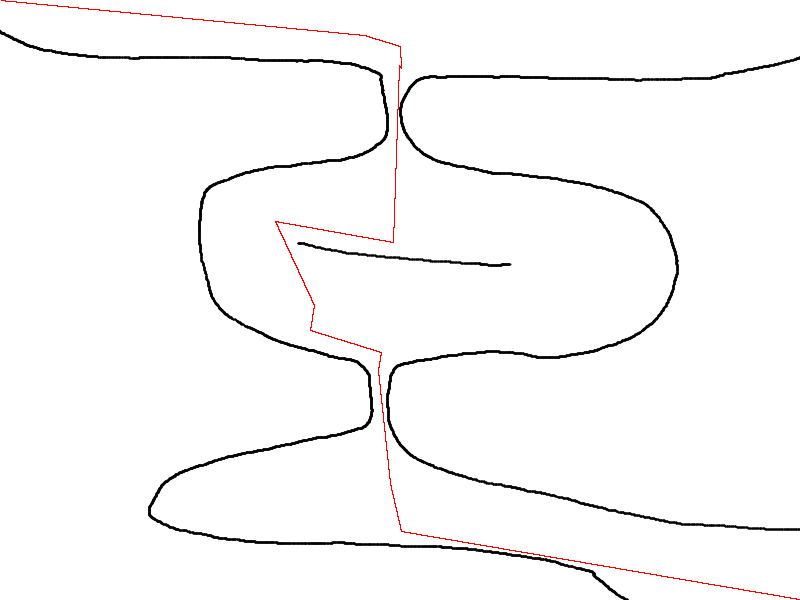

A small implementation of Rapidly Exploring Random Trees in Haskell and C++20

See: https://en.wikipedia.org/wiki/Rapidly-exploring_random_tree

The C++ implementation has a ROS interface:

## C++ implementation

The search takes place over `ConfigurationSpace`s, these are classes which
implement the necessary behaviour to perform steps in an RRT search, for
instance `sample`ing from the space of possible configurations.  In
[ConfigurationSpace.hpp](./cxx/ConfigurationSpace.hpp) there is a *concept*
`ConfigurationSpace` which defines this interface.

There are several wrapper class templates which can provide enhanced
functionality on an underlying `ConfigurationSpace`. For example the class
template `BiasTowardsGoal` (in
[SpaceModifiers.hpp](./cxx/SpaceModifiers.hpp)). This will bias the
underlying sample function towards sampling the goal configuration some
proportion of the time, so that the search doesn't have to "stumble" on the
goal configuration despite being in striking distance.

`ConfigurationSpace` (and hence most of the functionality here is so
parameterized) contains two associated types `Config` and `Reachability`.
`Config` represents the underlying state in a `ConfigurationSpace`, for example
in a 2-space `Config` might be a 2-tuple of `float`. `Reachability` is a
"proof" of reachability between states; for instance in a *kinetodynamic*
simulation it could represent the input given to the simulation to take it from
one configuration to another, or in a search involving another algorithm
calculating small steps it could be the result or parameters to the
small-stepper (note that when this is unnecessary or trivial we use the 0-tuple
`std::monostate`).

An interesting configuration space modifier is the `Blossom` class template (in
[Blossom.hpp](./cxx/Blossom.hpp)). This modifies the `step` function of the
underlying `ConfigurationSpace` to implement the *RRT-Blossom* algorithm.
Because the *RRT-Blossom* algorithm relies on having a finite set of possible
path extensions `Blossom` is itself parameterized over a function returning
such a set of extensions.

Another possible modifier would be one which maintains an acceleration
structure (for example a k-d tree) to speed up the nearest neighbor searches.

As for consuming these `ConfigurationSpace`s to perform the actual search,
there are two functions (in [RRT.hpp](./cxx/RRT.hpp)):

- `rrtSearch`: Perform a search with a single `Tree` growing from the starting
  configuration towards the goal.

- `rrtSearchDualTree`: Concurrently search forwards from the initial
  configuration and backwards from the gal configuration, trying to get the
  trees to meet in the middle.

### Tests

There is a small set of testcases in [test.cpp](./cxx/test.cpp), the running is
[catch2](https://github.com/catchorg/Catch2).

### Requisite libraries

Aside from `catch2` we use:

- [stb](https://github.com/nothings/stb) for image loading and saving

- [Eigen](https://eigen.tuxfamily.org/index.php?title=Main_Page) to make the
  small amount of vector math we do a little bit more verbose...

These can be sourced by the [Nix](https://nixos.org/) expression in `cxx`.

### Running the ROS code

- Enter a nix-shell `nix-shell` in the `cxx` directory
- Spawn `roscore &`
- Build the ROS packages `catkin_make`
- Source the ROS env script `source ./devel/setup.zsh`
- Run the map server and RRT runner:
  - `rosrun rrt rrt &`
  - `rosrun image2occupancy image2occupancy _image:=images/tunnel.png &`
- Run `rviz`, add the map and path displays and observe the found path.

### Notes

For (much needed) brevity's sake type synonyms for repetitive types are used,
when you see `Tree_` (note the `_` suffix) it means the `Tree` template indexed
by the only `Config` and `Reachability` in scope.

Bumped into a GCC ICE lol (`gcc says: Blossom.hpp:40:48: internal compiler
error: trying to capture ‘this’ in instantiation of generic lambda`) trying to
use `this` in a doubly-nested lambda, serves me right I guess.

### Future work

- Performance optimization, the RRT-Blossom searches in particular are a little
  lethargic, although the algorithm isn't well suited to the continuous spaces
  it's working on in the test suite.

- Enhanced discretization of continuous spaces for RRT-Blossom.

- `inotify` filesystem watching for the image ROS server.

- Go over the C++ and make things a little less verbose, at the moment it's
  pretty putrid, perhaps I'm just use to nice, terse Haskell.

-------------------------------

A bug in http://www.dgp.toronto.edu/~mac/pubs/rrt-blossom.pdf

Consider the following case of blossoming search (Algorithm 4) (without nullary
control inputs).

- An iteration of the search has a target configuration, `t`
- During the blossoming phase
  - A control input leads to a configuration, `n`, exactly on the end goal
    (certainly possible in discrete spaces).
  - Another control input leads to a configuration, `m`, closer to `t` than `n`
- The configuration returned by `GROW_TREE` is `m` as it is the closest to the
  target for this iteration `t`. The program does not terminate despite the
  fact that the goal has been reached, as the only configuration checked for
  proximity to the goal is `m`.
- The program can never rediscover the goal, as it will always count as a
  regression as the distance from the already discovered `n` will be minimal.

There are two possible corrections:

- Have every addition to the tree checked for proximity to the goal
- Check for the case where the nearest neighbor has zero distance away from the
  target.

The first solution has the advantage that the algorithm terminates promptly
when a solution is found, however it's not clear whether it is sufficient for
the dual tree search where the two trees could cover each other and their
respectve goals with alternate paths (proof pending).
